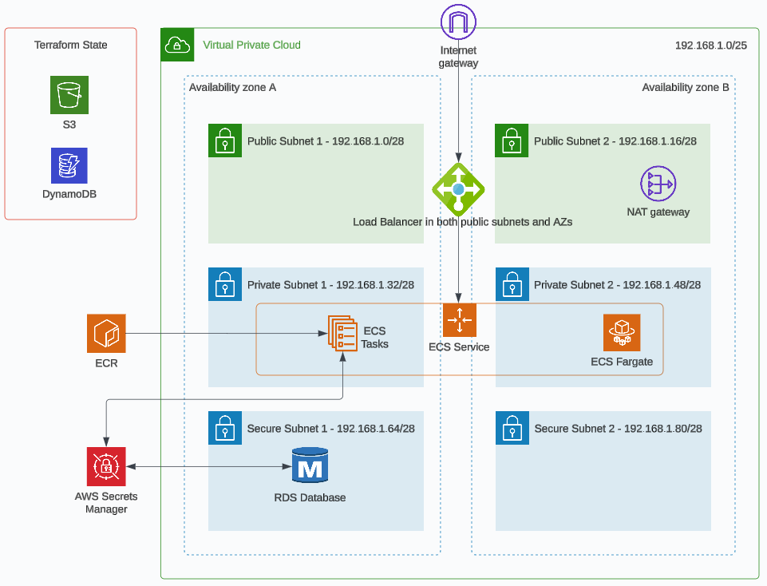

# Infra as Code - Lab Exercises

## Session 5 - Terraform Modules

These lab exercises are to be completed in order, you will need to have completed the lab exercise for session 4 before proceeding.

### Overview

You will learn how to implement both public and private modules as well as create a working web based solution with a database backend.


### Session 5 Goals

1. Refactor to include using both public and private modules.

2. Add an RDS instance to your AWS solution through your Terraform code and have a working website up and running.

3. Learn more about AWS Trust Advisor, AWS Compute Optimiser and reservations, spot, saving plans from a FinOps (cloud cost management) perspective.

4. Provide feedback on session 5


### Architecture Diagram

Users connect to the application through a public facing load balancer which has a target of an ECS task container which resides in the private subnets spread across two AZs.  In this session we're adding an RDS database and pushing a container image to ECR to get consumed by the ECS cluster service and run our container based application.




### Pre-requisites, Deploy and Clean Up Instructions

Please read the root level [README](../README.md) for instructions that are the same for every session on how to authenticate with AWS using the AWS CLI and how to run the Terraform commands to manage your infrastructure.

Hint: In the provider block, region variable or the *.tfvars file there is a value specified for the region, you should update this to match your AWS profile region.


### Steps/Tasks for Goal 1

1. Refactor the backend_support to use the public [S3 bucket module](https://github.com/terraform-aws-modules/terraform-aws-s3-bucket).  Try to ensure that all the original configuration is maintained with the refactor so nothing should change as far as configuration (however it's worth noting that the S3 module does not support a lifecycle attribute).  You will need to rerun 'terraform init' again in the backend_support directory because it's a module change within your project.  Then you can run terraform plan and apply to confirm it all works before progressing to the next step.

2. Refactor network.tf to use the public [VPC module](https://github.com/terraform-aws-modules/terraform-aws-vpc).  Then run terraform init and apply the changes in your root directory to confirm it all works before progressing to the next step.  It's important to point out an extra attribute 'single_nat_gateway' worth using otherwise by default you will create two NAT Gateways, one for each public subnet when in our case we just wish to create a single NAT Gateway in one of the public subnets.  There are also files which reference the VPC Id, public subnet and private subnet Ids, these will now have to reference the module's outputs for these values.

3. I strongly recommend before the next refactor to run the Terraform destroy command in your root directory to remove all our AWS resources (you don't have to destroy the remote state management resources as well) because it will be easier to refactor without getting conflicts with existing resources.  Now we should create a modules folder in the root directory.  We should also create a folder called ecs inside the modules folder, this will be the location for a new private module.  Move the ecs related files (ecs.tf, ecr.tf and iam-ecs.tf) into the ecs folder and create a new ecs.tf file at your root directory.  This new ecs.tf file should reference your new private module.  You need to work out what variables need to be passed in as well as outputs need to be passed out of this module for Terraform to work successfully (therefore the module will require a variables.tf and an outputs.tf).  Just like before rerun run the terraform init and apply in your root directory to confirm it all works before progressing to the next step.


### Steps/Tasks for Goal 2

Now we are going to add an RDS instance to your AWS solution using Terraform and have a working website up and running.  The database requires a password, we do not wish to create the password in Terraform otherwise it will be stored in the state file in plain text which is why we will manually create it in Secrets Manager instead.  Once the solution is up and running we should be able to use curl commands to interact with a REST API exposed via the load balancer.

1. Using the AWS Console (UI) manually create a new secret in AWS Secret Manager, select 'Other type of secret' and in the key value pair fields enter a key of 'db_password' and in the value field next to it enter a value for the password which complies with the following password requirements:

- Nine characters
- Two uppercase letters
- Two lowercase letters
- Two numbers
- One or more special characters (excluding '/', '@', '"', ' ')

After clicking next, name the secret dev/db (all other aspects of the creation wizard can be left as the defaults).

2. Now copy the file RDS.tf from this folder to your solution.  Notice in there the use of data resources to access secret manager to get the database password you have created.

3. Add new variables in variables.tf in your root directory for db_username (with a value of 'postgres') and db_name (also with a value of 'postgres').  Ensure the values are provided through your tfvars file.

4. In your ECS module ensure you have an output for the repository_url and expose that output to your root outputs.tf as well.

5. Also in the outputs.tf in your root directory add the load balancer dns_name with a suffix of 'http://' and a prefix of '/users' so the value provides a properly formatted URL.

6. Copy the contents of extra-iam-permissions.tf in this folder and append it to the end of iam-ecs.tf.  The contents you've copied is simply the permissions as a data source.  You need to associate this with your ecs task execution role using aws_iam_policy and aws_iam_role_policy_attachment Terraform resources.  You will also need to pass two new variables into the ECS module for the IAM permissions to access the secret (see references to var.db_secret_arn and var.db_secret_key_id).  This allows the container to access and decrypt the secret as it uses it in its connection string for the database connection.

7. Copy the contents of container.json in this folder over the top of container.json in your templates folder.  Notice it has some extra environment variables and a secret that is being passed in which create the database connection for the application to connect to the database.

8. You need to pass in extra variables to your ECS module:

```
  db_address = aws_db_instance.database.address
  db_name = var.db_name
  db_username = var.db_username
```

Pass these variables and the db_secret_arn into the container in the aws_ecs_task_definition resource in ecs.tf like below (here's an example showing the extra variables which have been added):

```
  container_definitions = templatefile("./templates/container.json", {
    application      = "example_app"
    image_url        = aws_ecr_repository.api.repository_url
    cloudwatch_group = aws_cloudwatch_log_group.ecs.name
    region           = var.region
    db_address       = var.db_address
    db_name          = var.db_name
    db_username      = var.db_username
    db_password_arn  = var.db_secret_arn
  })  
```

9. This next step will depend on whether you are running an M1 chipset (ARM architecture) on your laptop or not.  If you are not then skip this step, if you are then add this as an attribute into ECS aws_ecs_task_definition runtime to allow for the fact you will build and push an ARM based image for consumption:

  runtime_platform {
    cpu_architecture = "ARM64" # "ARM64" or "X86_64"
  } 

11. That's quite a fair amount of refactoring, now for the moment of truth, run the following commands to test deploying your updated solution:

```
terraform init
terraform plan -var-file="dev.tfvars"
terraform apply -var-file="dev.tfvars"
```

Troubleshoot any errors (it's expected there may be a few to work out) before proceeding to the next step. 


10. Once all resources have been deployed successsfully you can now build and push our container image to ECR.  First navigate in your terminal to the crud_app folder within this folder.  Now access the AWS Console (UI) and go to ECR and locate your ECR repository.  Click on the link to go into your repository, you'll see there are no images at the moment.  There should be a button called 'View push commands'.  Click on that button and a pop up will appear with instructions on how to authenticate with ECR and tag and push our image to ECR (please follow these instructions to push your image to your ECR).

11. Once the image has been uploaded into the ECR repository successfully you can then check ECS to see if this has fixed the ECS task service which would have been failing.  It should now be in a running state.  If not then please check the ECS task logs and the ECS Service events to troubleshoot any issues.  Assuming there are no errors and the ECS task is in a running state you can now access the REST API using a GET method with your web browser.  The URL should be in the output of your Terraform, it will be in the format of 'http://<load_balancer_dns_name>/users' which should return an empty array on screen.  You are now ready to test the REST API.

```
curl -X GET http://<load_balancer_dns_name>/users 
```

12. First I'll provide a little more information about the solution (a simple web based REST API) we've built and how to interact with it.  Using the web browser or curl command you can hit the load balancer's address with a path (/users) and a specified method (GET, POST, PUT, etc), the load balancer then routes this request to the ECS container which then passes its request in the form of SQL statements on to a Postgres database (RDS).  The REST API is extremely basic, there's no data validation or paramatisation from a security stand point, it provides CRUD capabilities for a basic working example for user data (you can easily give it bad data or do SQL injection).  To understand what data we should send the REST API you need to know the 'user' class which is defined as follows (Id is generated by the database):

```
type User struct {
	ID    int    `json:"id"`
	Name  string `json:"name"`
	Email string `json:"email"`
}
```

Here are the REST API routes:

```
	router.HandleFunc("/users", getUsers(db)).Methods("GET")
	router.HandleFunc("/users/{id}", getUser(db)).Methods("GET")
	router.HandleFunc("/users", createUser(db)).Methods("POST")
	router.HandleFunc("/users/{id}", updateUser(db)).Methods("PUT")
	router.HandleFunc("/users/{id}", deleteUser(db)).Methods("DELETE")
```

Knowing this information we can now use curl to add a new user using the REST API:

curl -X POST http://<load_balancer_dns_name>/users -d '{"name":"John Doe", "email":"jdoe@example.com"}' -H "Content-Type: application/json"

This should return a json object with an Id along with the data passed in.  This indicates that the command worked.  You can now either run a curl command or access the web browser at the address http://<load_balancer_dns_name>/users to confirm the user has been added.  You should be able to test out any of the REST API routes with this application.

13. Commit your code to your repo and name the commit 'Session 5'.


### Steps/Tasks for Goal 3 - FinOps

1. The first and primary objective of this goal is to destroy your resources once you have finished using them.  TW can only fund this IaC course if cloud costs continue to be low therefore we need your help.  Please ensure you have run the following to destroy your cloud resources.

```
terraform destroy --auto-approve -var-file="dev.tfvars"
cd backend_support
terraform destroy --auto-approve
```

It also doesn't take long to double check by logging in to the AWS console to verify all the resources have been terminated which should give you satisfaction that no unnecessary cloud costs are accummulating.

2. The second step of this goal is to review the cost of the resources we created in this lab exercise.  Like before we've worked out the costs using the [AWS Cost Calculator](https://calculator.aws/#/).  Now we've added our most expensive resource, the database, however this is only a small instance, we would run a larger instance size in production and possibly run it in Multi-AZ mode which provides extra redundancy but increases the costs.  Another important fact is this is just one very small solution, if we are running dev, test, uat and prod environments then costs quadruple.

| Resource / Service  | Quantity  |  Cost per Unit  | Cost per Year | Comments or extra info                        |
| ------------------- | --------- | --------------- | ------------- | --------------------------------------------- |
| VPC                 | 1         | 0.00            | 0.00          |                                               |
| Subnet              | 6         | 0.00            | 0.00          |                                               |
| Internet Gateway    | 1         | 0.00            | 0.00          |                                               |
| EIP                 | 1         | 3.65            | 43.80         |                                               |
| NAT Gateway         | 1         | 43.66           | 523.92        | 10 GB per month data processing               |
| Route Tables        | 2         | 0.00            | 0.00          |                                               |
| Data Transfer       | 1         | 3.42            | 41.04         | 30 GB per month outbound (guesstimate)        |
| DynamoDb (tf state) | 1         | 0.28            | 3.36          | 1 GB per month storage                        |
| S3 (tf state)       | 1         | 0.03            | 0.36          | 1 GB per month storage                        |
| ALB                 | 1         | 18.44           | 221.28        | 5 GB per month processing                     |
| ECR                 | 1         | 3.00            | 36.00         | 30 GB data stored                             |
| ECS                 | 1         | 43.22           | 518.64        | 1 x CPU, 2GB RAM                              |
| SecretsManager      | 1         | 0.40            | 4.80          | 4 x API calls per month                       |
| RDS                 | 1         | 45.41           | 544.92        | 1 x db.t3.small, 30 GB snapshot storage       |
| **Total**           | -         | **160.41**      | **1938.32**   |                                               |  

Note: Costs vary per region and will fluctuate due to AWS price changes and exchange rates, the prices above are for the Sydney region at the time of the README creation and are in USD.

It's worth highlighting the cost for Secrets Manager.  It's certainly not a large cost at all but we only have one secret.  If we had many secrets that cost would multiple and this is where it's worth knowing about alternative services.  Instead of storing your secrets in Secrets Manager you could store them as secure strings in SSM Paramater Store for free or you may store them externally and have your pipeline inject them.  Equally you may redesign the solution to not use RDS and instead use DynamoDB which might be cheaper alternative.  Another far cheaper solution to RDS is to store your data in S3 and use Athena to query the data instead.

3. [Trusted Advisor](https://docs.aws.amazon.com/awssupport/latest/user/trusted-advisor.html) is an AWS cloud service which inspects your AWS infrastructure and then provides recommendations in various areas to align with best practices (one of those areas is cost optimisation).  There is a the free basic tier as well as a business tier which provides extra recommendations and features.  Here are some examples of the recommendations relating to cost optimization checks that inspect the utilization of resources and flag resources with low utilization:

- Amazon RDS Idle DB Instances
- Idle Load Balancers
- Low Utilization Amazon EC2 Instances
- Unassociated Elastic IP Addresses
- Underutilized Amazon EBS Volumes
- Underutilized Amazon Redshift Clusters

The following cost optimization checks provide reservation and savings plan recommendations also through Trusted Advisor:

- Amazon EC2 Reserved Instance Lease Expiration
- Amazon EC2 Reserved Instances Optimization, Amazon ElastiCache Reserved Node Optimization, Amazon OpenSearch Reserved Instance Optimization, Amazon Redshift Reserved Node Optimization, and Amazon Relational Database Service (RDS) Reserved Instance Optimization.
- Savings Plan

Reservations, spot pricing and savings plans are alternative and usually much cheaper pricing plans when compared to default on-demand pricing for your cloud resources.  Here are some more details on the common AWS pricing models:

- On-Demand: Pay for compute capacity by the hour with no long-term commitments. Good for spiky workloads or yet to be defined needs.
- [Reserved](https://docs.aws.amazon.com/whitepapers/latest/cost-optimization-reservation-models/reservation-models-for-other-aws-services.html): Make an Amazon EC2 usage commitment and receive a significant discount.  This is for a committed utilization (1 or 3 years).
- [Spot](https://aws.amazon.com/ec2/spot/pricing/): Bid for unused capacity, charged at a 'Spot Price' which fluctuates based on supply and demand. Ideal for time-insensitive or transient workloads.
- [Savings Plans](https://aws.amazon.com/savingsplans/): Allows you to apply long term savings similar to reserved but not associated with instances, therefore it can include serverless (Lambda, Fargate, etc).

If you choose an EC2 reservation for an instance type (e.g. t3.large) for 3 years then you will get a large discount compared to the on-demand cost for the same resource over the same period.  If the solution you purchased the reservation for needs more resources so you decide to up-size the instance type (e.g. t3.xlarge) then you will end up paying for the on-demand cost and as well as the reservation cost (therefore more than double) which is why you need to be careful when you plan your reservation costs, hence reservations are most suitable for static workloads that run 24/7 although there are now more flexible reservation options allowing you to make changes if need be.

One aspect with choosing the right reservation is to rightsize your instance type as you want to ensure optimum utilisation for its cost.  You can use [AWS Cost Optimiser](https://aws.amazon.com/compute-optimizer/) to help with the identifying the correct instance types for the workloads which could also help to reduce costs.


### Steps/Tasks for Goal 4 - Session Feedback

We can only make improvements if we receive feedback.  Please can you fill out this very short [survey](https://docs.google.com/forms/d/e/1FAIpQLSfeK9c64dJK7mvRv3rIVc95yajv6h_WT6lDyisM4ag76OoF3g/viewform) to help us understand what you liked or disliked and the learnings you've gained from this, thank you.